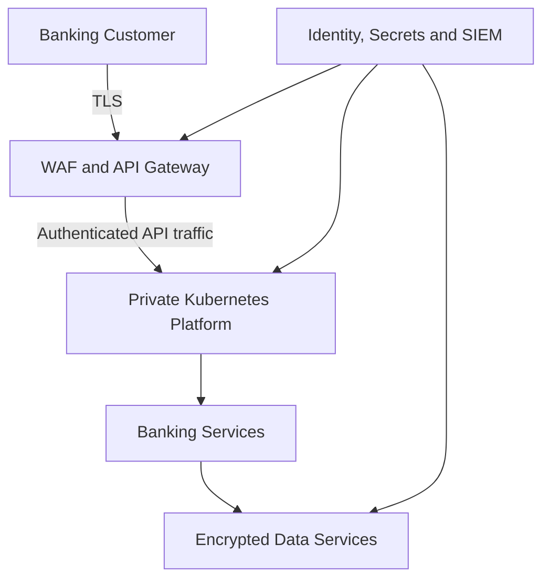

# Cloud-Native Banking Security

[](https://github.com/AmrAbd-Elaziz/cloud-native-banking-security/actions/workflows/security-pipeline.yml)


A hands-on multi-cloud security architecture project demonstrating threat
modeling, Kubernetes hardening, AWS and Azure Infrastructure as Code
remediation, PCI DSS control mapping and automated CI/CD security gates.

> **Security notice:** This repository represents a fictional banking
> environment created exclusively for authorized security training and
> portfolio demonstration. It contains no real customer data, production
> credentials or approved production deployment configuration.

## Executive Summary

This project models a fictional cloud-native banking platform supporting
customer authentication, account information, internal transfers, payments,
transaction history and security monitoring.

The project demonstrates the complete security engineering lifecycle:

1. Define critical assets, trust boundaries and data flows
2. Perform STRIDE threat modeling
3. Create and prioritize a risk register
4. Review vulnerable Kubernetes and cloud configurations
5. Preserve repeatable security baselines
6. Implement defensive remediation
7. Validate closure with automated scanning
8. Map security controls to PCI DSS themes
9. Enforce security gates through GitHub Actions

## Key Results

| Security Domain | Vulnerable Baseline | Remediated Result | Findings Resolved |
|---|---:|---:|---:|
| Kubernetes | 32 failed | 93 passed, 0 failed | 32 |
| AWS Terraform | 40 failed | 68 passed, 0 failed | 40 |
| Azure Terraform | 45 failed | 60 passed, 0 failed, 2 documented skips | 45 |
| **Total** | **117 failed** | **0 failed** | **117** |

The two Azure skips are documented compatibility exceptions. They preserve
modern AzureRM security controls instead of reintroducing deprecated resources
or shared-key authentication solely to satisfy outdated scanner relationships.

## Architecture Overview



The detailed architecture includes:

- Internet-facing security controls
- Web Application Firewall
- API gateway and authentication boundary
- Private Kubernetes workload platform
- Account, transfer and payment services
- Encrypted database and transaction storage
- Central secrets and key management
- Central security monitoring and audit evidence
- Separate management, workload and data trust boundaries

See [Architecture](docs/ARCHITECTURE.md) for the complete design and data-flow
analysis.

## Threat Modeling and Risk Assessment

The platform was assessed using STRIDE across identities, APIs, Kubernetes,
cloud control planes, databases, audit systems and administrative boundaries.

| STRIDE Category | Example Banking Threat |
|---|---|
| Spoofing | Stolen identity or workload credentials |
| Tampering | Unauthorized transaction or audit-log modification |
| Repudiation | Inadequate evidence for sensitive banking operations |
| Information Disclosure | Exposure of account or transaction data |
| Denial of Service | Resource exhaustion against banking APIs |
| Elevation of Privilege | Excessive IAM or Kubernetes RBAC permissions |

Project threat and risk documentation:

- [STRIDE Threat Model](docs/threat-model/STRIDE.md)
- [Risk Register](docs/threat-model/RISK-REGISTER.md)
- [Security Architecture Review](docs/architecture-review/SECURITY-REVIEW.md)
- [PCI DSS Control Mapping](docs/compliance/PCI-DSS-MAPPING.md)

## Kubernetes Security Assessment

### Vulnerable State

The intentionally vulnerable Kubernetes workload included:

- Wildcard ClusterRole permissions
- Cluster-wide privilege escalation paths
- Automatic serviceAccount token mounting
- Privileged root execution
- All Linux capabilities
- Host network and PID namespace sharing
- Host root filesystem mounting
- Mutable `latest` container image
- No CPU or memory limits
- No health probes
- No NetworkPolicy

### Remediated State

The hardened workload implements:

- Removal of unnecessary cluster-wide RBAC
- Disabled service-account token automount
- Non-root high UID execution
- Privileged mode disabled
- Privilege escalation disabled
- All Linux capabilities dropped
- Read-only root filesystem
- RuntimeDefault seccomp
- Immutable image digest
- Resource requests and limits
- Readiness and liveness probes
- Default-deny network controls
- Restricted ingress and DNS egress
- Restricted Pod Security namespace labels

Evidence:

- [Kubernetes Baseline](docs/KUBERNETES-BASELINE.md)
- [Kubernetes Remediation](docs/KUBERNETES-REMEDIATION.md)
- [Vulnerable Manifest](kubernetes/vulnerable/banking-api.yaml)
- [Remediated Manifest](kubernetes/remediated/banking-api.yaml)

## AWS Security Assessment

The vulnerable AWS Terraform modeled public financial storage, unrestricted
IAM, an exposed database, a public EKS control plane and insufficient audit
retention.

The remediated design implements:

- S3 Block Public Access
- Bucket-owner-enforced ownership
- Customer-managed KMS encryption
- S3 versioning, lifecycle and replication
- HTTPS-only bucket policy
- Least-privilege IAM
- Private encrypted RDS
- AWS-managed database credentials
- IAM database authentication
- Multi-AZ and backup retention
- Private EKS control-plane access
- EKS secrets encryption
- Complete control-plane logging
- Encrypted CloudWatch logs with 365-day retention
- Terraform provider dependency locks

Evidence:

- [AWS Terraform Baseline](docs/AWS-TERRAFORM-BASELINE.md)
- [AWS Terraform Remediation](docs/AWS-TERRAFORM-REMEDIATION.md)
- [Vulnerable AWS Configuration](infrastructure/vulnerable/aws)
- [Remediated AWS Configuration](infrastructure/remediated/aws)

## Azure Security Assessment

The vulnerable Azure Terraform modeled public Blob Storage, exposed Azure SQL,
weak Key Vault isolation, permissive networking and a public AKS control
plane.

The remediated design implements:

- Private Storage, SQL, Key Vault and AKS access
- TLS 1.2 enforcement
- Shared-key authentication disabled
- Microsoft Entra authentication
- HSM-backed customer-managed keys
- Key expiration and automatic rotation
- Key Vault RBAC and purge protection
- Azure SQL TDE, auditing and threat detection
- Azure SQL zone redundancy and retention
- Private AKS with Azure RBAC
- Azure CNI and Network Policy
- Workload Identity and OIDC
- Key Vault CSI secret rotation
- Microsoft Defender and Azure Monitor
- Ephemeral and encrypted AKS node disks
- Terraform provider dependency locks

Evidence:

- [Azure Terraform Baseline](docs/AZURE-TERRAFORM-BASELINE.md)
- [Azure Terraform Remediation](docs/AZURE-TERRAFORM-REMEDIATION.md)
- [Vulnerable Azure Configuration](infrastructure/vulnerable/azure)
- [Remediated Azure Configuration](infrastructure/remediated/azure)

## Automated Security Pipeline

The GitHub Actions pipeline executes four independent jobs.

| Job | Security Purpose |
|---|---|
| Secret Scanning | Scans complete Git history using Gitleaks |
| Terraform Validation | Initializes locked providers and validates AWS and Azure configurations |
| Vulnerable Baseline Evidence | Preserves repeatable non-blocking evidence from intentionally vulnerable configurations |
| Remediated Security Gates | Blocks the pipeline if Kubernetes, AWS or Azure remediated configurations fail Checkov |

Pipeline supply-chain controls include:

- GitHub Actions pinned to immutable commit SHAs
- Security scanner containers pinned to immutable digests
- Terraform providers pinned by dependency lock files
- Minimal read-only GitHub token permissions
- Checkout credentials not persisted
- Explicit job timeouts
- Concurrency cancellation
- Security reports retained as workflow artifacts

Latest validated execution:

[GitHub Actions Run 34331882334](https://github.com/AmrAbd-Elaziz/cloud-native-banking-security/actions/runs/34331882334)

Produced artifacts:

- `secret-scanning-report`
- `terraform-validation-reports`
- `vulnerable-baseline-reports`
- `remediated-security-reports`

## Local Security Validation

### Check Kubernetes

```bash
docker run --rm \
  -v "${PWD}:/repo" \
  bridgecrew/checkov@sha256:7407699a91a556849ae66e05c3753f58cf0ce922aa6ddfac7839aad4f390c016 \
  -f /repo/kubernetes/remediated/banking-api.yaml \
  --framework kubernetes
```

### Check AWS Terraform

```bash
docker run --rm \
  -v "${PWD}:/repo" \
  bridgecrew/checkov@sha256:7407699a91a556849ae66e05c3753f58cf0ce922aa6ddfac7839aad4f390c016 \
  -d /repo/infrastructure/remediated/aws \
  --framework terraform
```

### Check Azure Terraform

```bash
docker run --rm \
  -v "${PWD}:/repo" \
  bridgecrew/checkov@sha256:7407699a91a556849ae66e05c3753f58cf0ce922aa6ddfac7839aad4f390c016 \
  -d /repo/infrastructure/remediated/azure \
  --framework terraform
```

### Validate Terraform

```bash
docker run --rm \
  -v "${PWD}/infrastructure/remediated/aws:/workspace" \
  -w /workspace \
  hashicorp/terraform@sha256:18f9986038bbaf02cf49db9c09261c778161c51dcc7fb7e355ae8938459428cd \
  init -backend=false -lockfile=readonly
```

```bash
docker run --rm \
  -v "${PWD}/infrastructure/remediated/aws:/workspace" \
  -w /workspace \
  hashicorp/terraform@sha256:18f9986038bbaf02cf49db9c09261c778161c51dcc7fb7e355ae8938459428cd \
  validate
```

Repeat the same commands using:

```text
infrastructure/remediated/azure
```

> Do not run `terraform apply`. The identifiers and architecture are fictional
> and designed for static security analysis.

## Repository Structure

```text
.
├── .github/
│   └── workflows/
│       └── security-pipeline.yml
├── docs/
│   ├── ARCHITECTURE.md
│   ├── AWS-TERRAFORM-BASELINE.md
│   ├── AWS-TERRAFORM-REMEDIATION.md
│   ├── AZURE-TERRAFORM-BASELINE.md
│   ├── AZURE-TERRAFORM-REMEDIATION.md
│   ├── KUBERNETES-BASELINE.md
│   ├── KUBERNETES-REMEDIATION.md
│   ├── architecture-review/
│   │   └── SECURITY-REVIEW.md
│   ├── compliance/
│   │   └── PCI-DSS-MAPPING.md
│   └── threat-model/
│       ├── RISK-REGISTER.md
│       └── STRIDE.md
├── infrastructure/
│   ├── vulnerable/
│   │   ├── aws/
│   │   └── azure/
│   └── remediated/
│       ├── aws/
│       └── azure/
├── kubernetes/
│   ├── vulnerable/
│   └── remediated/
└── security-reports/
    ├── baseline/
    └── remediated/
```

## Security Engineering Principles Demonstrated

- Defense in depth
- Least privilege
- Secure-by-default configuration
- Private connectivity
- Strong identity and authentication
- Encryption in transit and at rest
- Cryptographic key lifecycle management
- Network segmentation
- Centralized logging and evidence retention
- Resilience and recovery
- Automated preventive security gates
- Manual validation of scanner results
- Transparent documentation of justified exceptions

## Scope and Limitations

This project is a static security architecture and Infrastructure as Code
assessment.

It does not claim:

- Deployment to a production cloud environment
- Formal PCI DSS certification
- Validation against real banking data
- Replacement for cloud runtime monitoring
- Replacement for penetration testing or organizational risk approval

Production implementation would require approved subscriptions and accounts,
real network architecture, private DNS, identity governance, tested recovery,
runtime monitoring, change control and independent assurance.

## Author

**Amr Abdelaziz**
Cybersecurity Engineer — Application Security, Cloud Security and DevSecOps

[LinkedIn](https://www.linkedin.com/in/amr-ahmed-abdelaziz94/) |
[GitHub](https://github.com/AmrAbd-Elaziz)